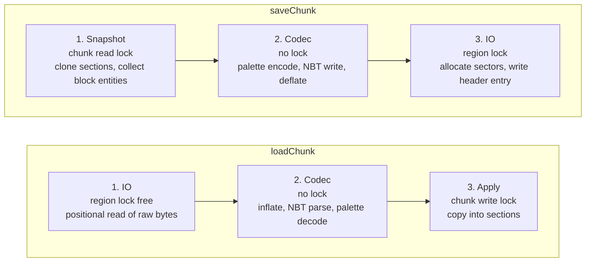

# Anvil chunk loader

`AvesAnvilLoader` is a `net.minestom.server.instance.ChunkLoader` implementation that reads and
writes chunks in the Anvil region file format (`r.<x>.<z>.mca`). It is a drop-in replacement for
`net.minestom.server.instance.anvil.AnvilLoader` and targets servers that load or save many chunks
concurrently, that need a read failure to stay visible instead of being silently replaced by a
freshly generated chunk, and that need to keep serving worlds containing blocks or biomes the
server does not know. It is not a general world-management layer: it handles the `region/`
directory of a single dimension and nothing else (see
[What this loader does NOT do](#what-this-loader-does-not-do)). All references in this document
point at the sources of this branch and at Minestom `2026.06.20-26.1.2`.

## Status

> **Experimental.** Every public type of `net.theevilreaper.aves.instance.anvil` and
> `ChunkLoaderFactory` is annotated `@ApiStatus.Experimental`, as is the four-argument
> `AbstractMapProvider.registerInstance` overload. Signatures, class layout and behaviour may still
> change in a minor release. Do not rely on it in code you cannot adapt.

The annotation is present on all thirteen public types of the package —
[`AvesAnvilLoader:66`](../src/main/java/net/theevilreaper/aves/instance/anvil/AvesAnvilLoader.java#L66),
[`RegionFile:39`](../src/main/java/net/theevilreaper/aves/instance/anvil/RegionFile.java#L39),
[`RegionConstants:24`](../src/main/java/net/theevilreaper/aves/instance/anvil/RegionConstants.java#L24),
[`ChunkCompression:34`](../src/main/java/net/theevilreaper/aves/instance/anvil/ChunkCompression.java#L34),
[`BitPacker:24`](../src/main/java/net/theevilreaper/aves/instance/anvil/BitPacker.java#L24),
[`PaletteData:38`](../src/main/java/net/theevilreaper/aves/instance/anvil/PaletteData.java#L38),
[`PaletteEntryResolver:26`](../src/main/java/net/theevilreaper/aves/instance/anvil/PaletteEntryResolver.java#L26),
[`BlockPaletteResolver:34`](../src/main/java/net/theevilreaper/aves/instance/anvil/BlockPaletteResolver.java#L34),
[`BiomePaletteResolver:38`](../src/main/java/net/theevilreaper/aves/instance/anvil/BiomePaletteResolver.java#L38),
[`NbtReads:40`](../src/main/java/net/theevilreaper/aves/instance/anvil/NbtReads.java#L40),
[`SectionCodec:35`](../src/main/java/net/theevilreaper/aves/instance/anvil/SectionCodec.java#L35),
[`AnvilDiagnostics:35`](../src/main/java/net/theevilreaper/aves/instance/anvil/AnvilDiagnostics.java#L35),
[`AnvilChunkException:23`](../src/main/java/net/theevilreaper/aves/instance/anvil/AnvilChunkException.java#L23) —
plus [`ChunkLoaderFactory:27`](../src/main/java/net/theevilreaper/aves/map/provider/ChunkLoaderFactory.java#L27)
and [`AbstractMapProvider:108`](../src/main/java/net/theevilreaper/aves/map/provider/AbstractMapProvider.java#L108).
(`SectorAllocator` is package-private and carries no annotation.)

**Opt-in only.** Nothing switches to this loader by itself. `AbstractMapProvider` keeps
`net.minestom.server.instance.anvil.AnvilLoader` as its default and only uses `AvesAnvilLoader` when
a `ChunkLoaderFactory` is passed explicitly
([`AbstractMapProvider.java:50-51`](../src/main/java/net/theevilreaper/aves/map/provider/AbstractMapProvider.java#L50-L51),
[`:92`](../src/main/java/net/theevilreaper/aves/map/provider/AbstractMapProvider.java#L92)). Existing
providers therefore behave exactly as before.

## Usage

### Directly on an instance

```java
import net.kyori.adventure.key.Key;
import net.minestom.server.MinecraftServer;
import net.minestom.server.instance.InstanceContainer;
import net.minestom.server.world.DimensionType;
import net.theevilreaper.aves.instance.anvil.AvesAnvilLoader;

import java.nio.file.Path;

public final class Bootstrap {

    public static InstanceContainer createLobby() {
        InstanceContainer instance = MinecraftServer.getInstanceManager()
                .createInstanceContainer(DimensionType.OVERWORLD);

        Key dimension = DimensionType.OVERWORLD.key();
        AvesAnvilLoader loader = new AvesAnvilLoader(Path.of("worlds", "lobby"), dimension);

        instance.setChunkLoader(loader);
        instance.enableAutoChunkLoad(true);
        return instance;
    }
}
```

`AvesAnvilLoader(Path worldRoot, Key dimension)` takes the **world root**, not the region
directory. It resolves `worldRoot/dimensions/<namespace>/<value>/region` and falls back to
`worldRoot/region` when only the pre-26.1 layout exists
([`AvesAnvilLoader.java:125-133`](../src/main/java/net/theevilreaper/aves/instance/anvil/AvesAnvilLoader.java#L125-L133)).

The loader implements `AutoCloseable`. `close()` flushes and closes every open region file and
writes the summary line
([`AvesAnvilLoader.java:308-330`](../src/main/java/net/theevilreaper/aves/instance/anvil/AvesAnvilLoader.java#L308-L330)).
Call it on server shutdown. During operation a region file is closed on its own once the last chunk
this loader read from it has been unloaded, and the number of simultaneously open files is capped by
`DEFAULT_OPEN_REGION_LIMIT` (64, configurable through the three-argument constructor).

### Through a map provider

`AbstractMapProvider` keeps the Minestom loader as the default, so existing providers are
unaffected. A provider opts in by passing `ChunkLoaderFactory.anvil()` to the four-argument
`registerInstance` overload:

```java
import net.minestom.server.instance.InstanceContainer;
import net.minestom.server.world.DimensionType;
import net.theevilreaper.aves.file.FileHandler;
import net.theevilreaper.aves.map.BaseMap;
import net.theevilreaper.aves.map.MapEntry;
import net.theevilreaper.aves.map.provider.AbstractMapProvider;
import net.theevilreaper.aves.map.provider.ChunkLoaderFactory;
import net.theevilreaper.aves.util.functional.PathFilter;

import java.nio.file.Path;

public final class LobbyMapProvider extends AbstractMapProvider {

    public LobbyMapProvider(FileHandler fileHandler, PathFilter<MapEntry> mapFilter) {
        super(fileHandler, mapFilter);
    }

    public void register(InstanceContainer instance, MapEntry mapEntry) {
        // Uses AvesAnvilLoader instead of the Minestom AnvilLoader.
        registerInstance(instance, mapEntry, DimensionType.OVERWORLD, ChunkLoaderFactory.anvil());
    }

    @Override
    public void saveMap(Path path, BaseMap baseMap) {
        // provider specific
    }
}
```

The relevant signatures are:

| Member | Declaration |
| --- | --- |
| [`ChunkLoaderFactory.anvil()`](../src/main/java/net/theevilreaper/aves/map/provider/ChunkLoaderFactory.java#L37) | `static ChunkLoaderFactory anvil()` |
| [`ChunkLoaderFactory.create(..)`](../src/main/java/net/theevilreaper/aves/map/provider/ChunkLoaderFactory.java#L48) | `ChunkLoader create(MapEntry mapEntry, Key dimension)` |
| [`AbstractMapProvider.registerInstance(..)`](../src/main/java/net/theevilreaper/aves/map/provider/AbstractMapProvider.java#L109-L114) | `protected void registerInstance(InstanceContainer instance, MapEntry mapEntry, RegistryKey<DimensionType> dimensionKey, ChunkLoaderFactory loaderFactory)` |
| [`AvesAnvilLoader(..)`](../src/main/java/net/theevilreaper/aves/instance/anvil/AvesAnvilLoader.java#L102) | `public AvesAnvilLoader(Path worldRoot, Key dimension)` |

The factory receives `MapEntry.getDirectoryRoot()` as the world root and the dimension key of the
instance ([`ChunkLoaderFactory.java:38`](../src/main/java/net/theevilreaper/aves/map/provider/ChunkLoaderFactory.java#L38),
[`AbstractMapProvider.java:115`](../src/main/java/net/theevilreaper/aves/map/provider/AbstractMapProvider.java#L115)).
Any other `ChunkLoader` can be supplied the same way, because `ChunkLoaderFactory` is a functional
interface:

```java
registerInstance(instance, mapEntry, DimensionType.OVERWORLD,
        (entry, dimension) -> new AvesAnvilLoader(entry.getDirectoryRoot(), dimension));
```

## Architecture

### The three-stage pipeline

Both loading and saving are split into three stages. The point of the split is that no CPU-bound
work happens while a lock is held. Decompression, NBT parsing, palette conversion and compression
are the expensive parts of chunk IO; if they run inside a per-region lock, adding threads adds
contention and nothing else, because every thread touching the same region file has to wait for
them.



Plain text form:

```
loadChunk:  read raw bytes  ->  inflate + parse + decode  ->  apply to chunk
            (no region lock)      (no lock at all)             (chunk write lock)

saveChunk:  clone sections  ->  encode + write NBT + deflate  ->  write sectors
            (chunk read lock)     (no lock at all)                 (region lock)
```

Concretely:

* **Load stage 1** — `RegionFile.readRaw` returns the still-compressed payload and takes no lock;
  it uses `FileChannel.read(ByteBuffer, long)`, which does not mutate the channel position and is
  therefore safe from several threads
  ([`RegionFile.java:161-200`](../src/main/java/net/theevilreaper/aves/instance/anvil/RegionFile.java#L161-L200)).
* **Load stage 2** — decompression and NBT parsing happen in the caller
  ([`AvesAnvilLoader.java:153`](../src/main/java/net/theevilreaper/aves/instance/anvil/AvesAnvilLoader.java#L153)).
  `decodeSections` then returns a `List<DecodedSection>`
  ([`AvesAnvilLoader.java:425-451`](../src/main/java/net/theevilreaper/aves/instance/anvil/AvesAnvilLoader.java#L425-L451)),
  and it is called at
  [`:168`](../src/main/java/net/theevilreaper/aves/instance/anvil/AvesAnvilLoader.java#L168) —
  **before** the chunk lock is taken at
  [`:170`](../src/main/java/net/theevilreaper/aves/instance/anvil/AvesAnvilLoader.java#L170).
  Everything costly happens here: resolving every palette entry through the resolvers, deriving the
  bits per entry, validating the packed arrays and reading the light arrays. The result is a list of
  immutable records carrying the section index, the decoded block and biome `PaletteData` and the
  two light arrays
  ([`AvesAnvilLoader.java:481-512`](../src/main/java/net/theevilreaper/aves/instance/anvil/AvesAnvilLoader.java#L481-L512)).
* **Load stage 3** — the chunk write lock is taken, each record is transferred via
  `DecodedSection.applyTo(chunk)`, the block entities are placed, and the lock is released
  ([`AvesAnvilLoader.java:170-178`](../src/main/java/net/theevilreaper/aves/instance/anvil/AvesAnvilLoader.java#L170-L178)).
  The guarded region performs no parsing and no palette resolution at all — only writes into
  `Section.skyLight()`, `Section.blockLight()`, `Section.blockPalette()` and `Section.biomePalette()`
  ([`AvesAnvilLoader.java:496-511`](../src/main/java/net/theevilreaper/aves/instance/anvil/AvesAnvilLoader.java#L496-L511)).
  This split is the concrete implementation of the pipeline: the record type exists purely to carry
  decoded state across the lock boundary.
* **Save stage 1** — the chunk **read** lock is held only long enough to clone every `Section` and
  collect the block entities
  ([`AvesAnvilLoader.java:596-607`](../src/main/java/net/theevilreaper/aves/instance/anvil/AvesAnvilLoader.java#L596-L607)).
* **Save stage 2** — encoding, NBT serialisation and deflate run on the clones, outside every lock
  ([`AvesAnvilLoader.java:609-627`](../src/main/java/net/theevilreaper/aves/instance/anvil/AvesAnvilLoader.java#L609-L627),
  [`AvesAnvilLoader.java:205-212`](../src/main/java/net/theevilreaper/aves/instance/anvil/AvesAnvilLoader.java#L205-L212)).
* **Save stage 3** — the region lock covers sector allocation, the payload write and the 8-byte
  header entry update, nothing else
  ([`RegionFile.java:233-248`](../src/main/java/net/theevilreaper/aves/instance/anvil/RegionFile.java#L233-L248)).

`supportsParallelLoading()` and `supportsParallelSaving()` both return `true`
([`AvesAnvilLoader.java:268-278`](../src/main/java/net/theevilreaper/aves/instance/anvil/AvesAnvilLoader.java#L268-L278)),
so `InstanceContainer` dispatches loads onto virtual threads
([Minestom `InstanceContainer.java:362-372`](#references)).

### Classes and their responsibility

Every class in `net.theevilreaper.aves.instance.anvil` has exactly one job, which is what makes
most of the package testable without a running server.

| Class | Single responsibility |
| --- | --- |
| `RegionConstants` | Layout constants of the region format and pure offset/index arithmetic. No state. |
| `SectorAllocator` | Tracks used sectors in a `BitSet`, first-fit allocation, reuse of freed ranges, overlap detection. No file access. |
| `RegionFile` | Byte container for one `.mca` file: header tables, sector placement, raw read/write, `.mcc` overflow. Knows nothing about NBT or Minestom. |
| `ChunkCompression` | The compression scheme byte: id mapping, external flag, compress/decompress. |
| `BitPacker` | Packing and unpacking of palette indices into `long[]`, and derivation of bits-per-entry. Pure functions. |
| `PaletteData` | Immutable palette + packed indices pair; construction from disk, construction from raw values, unpacking. |
| `PaletteEntryResolver` | Interface between named format entries and numeric server ids. |
| `BlockPaletteResolver` | Block name/properties ↔ Minestom block state id, with air fallback. |
| `BiomePaletteResolver` | Biome name ↔ registry id, with plains fallback and lazily resolved registry. |
| `NbtReads` | Strict accessors for Adventure NBT: a missing or mistyped key is an error, not a default. |
| `SectionCodec` | Palette container (`palette` + `data`) ↔ `PaletteData`, for blocks and biomes. |
| `AnvilDiagnostics` | Throttling of repeated warnings and the counters reported on close. Thread safe. |
| `AnvilChunkException` | The unchecked failure signalling that an existing chunk could not be read. |
| `AvesAnvilLoader` | Orchestration: region file cache, the three stages, block entities, logging, `saveChunks` scheduling. |

`NbtReads` exists because `CompoundBinaryTag` getters return defaults for missing or mistyped keys.
For chunk data that default is dangerous: a malformed region file would decode into an empty chunk
which then overwrites the real data on the next save
([`NbtReads.java:19-29`](../src/main/java/net/theevilreaper/aves/instance/anvil/NbtReads.java#L19-L29)).
It also avoids the array-tag iterators of Adventure 5.1.1, which stop one entry early
([`NbtReads.java:54-64`](../src/main/java/net/theevilreaper/aves/instance/anvil/NbtReads.java#L54-L64)).

### Lazy registry resolution

`BiomePaletteResolver` does **not** read the biome registry in its constructor. It stores a
`Supplier<DynamicRegistry<Biome>>` and resolves it on first use, behind double-checked locking on a
`volatile` field holding a private `Registries` record
([`BiomePaletteResolver.java:45-52`](../src/main/java/net/theevilreaper/aves/instance/anvil/BiomePaletteResolver.java#L45-L52),
[`:80-94`](../src/main/java/net/theevilreaper/aves/instance/anvil/BiomePaletteResolver.java#L80-L94)).
The record pairs the registry with the id of the fallback biome, so both are published together by
a single volatile write
([`BiomePaletteResolver.java:106-107`](../src/main/java/net/theevilreaper/aves/instance/anvil/BiomePaletteResolver.java#L106-L107)).

The reason is a hard ordering constraint. `MinecraftServer.getBiomeRegistry()` dereferences the
static `serverProcess` field (Minestom `MinecraftServer.java:280`), which stays `null` until
`MinecraftServer.init(..)` assigns it through `updateProcess` (`MinecraftServer.java:85-88`,
`:95-99`). Calling it earlier throws. Resolving the registry in the constructor would therefore make
a loader impossible to construct before `MinecraftServer.init(..)` has run — which is exactly when
worlds and map providers are normally set up. Deferring the lookup to the first decoded biome
palette means the loader can be constructed at any point during startup, and the registry is read
only once a chunk is actually being loaded.

The same constraint is what makes the Minestom `AnvilLoader` hard to use early and hard to unit
test: it reads the registry in a static initialiser (`instance/anvil/AnvilLoader.java:46-48`), so
merely referencing the class before `init` fails. The two-argument constructor of
`BiomePaletteResolver` exists so a test can inject a registry without a server
([`BiomePaletteResolver.java:70-76`](../src/main/java/net/theevilreaper/aves/instance/anvil/BiomePaletteResolver.java#L70-L76)).

`BlockPaletteResolver` needs no such treatment: `Block.fromKey` and `Block.fromStateId` are static
registry lookups performed per palette entry, not cached at class initialisation
([`BlockPaletteResolver.java:58`](../src/main/java/net/theevilreaper/aves/instance/anvil/BlockPaletteResolver.java#L58),
[`:79`](../src/main/java/net/theevilreaper/aves/instance/anvil/BlockPaletteResolver.java#L79)).

## Comparison with the built-in AnvilLoader

Minestom paths below are relative to `net/minestom/server/`, at version `2026.06.20-26.1.2`.
Aves paths are relative to `src/main/java/net/theevilreaper/aves/`.

| Aspect | Minestom `AnvilLoader` | Aves `AvesAnvilLoader` | Impact |
| --- | --- | --- | --- |
| **Chunk length field** | Writes `4 + 1 + N`: `CHUNK_HEADER_LENGTH = 4 + 1` (`instance/anvil/RegionFile.java:31`), `chunkLength = CHUNK_HEADER_LENGTH + dataBytes.length` (`:99`), `file.writeInt(chunkLength)` (`:123`). | Writes `1 + N`: `int length = COMPRESSION_FIELD_SIZE + stored.length` (`instance/anvil/RegionFile.java:225-226`), `buffer.putInt(length)` (`:230`). | The format defines the field as compression byte + payload. Minestom's own reader compensates by reading `length - 1` bytes (`RegionFile.java:84`), so its files are self-consistent, but every chunk it writes declares four bytes more than it holds. A spec-conforming reader over-reads up to four bytes of sector padding, and when the payload ends within four bytes of a sector boundary it reads past the allocation. Aves writes the value the format specifies. |
| **Short reads** | `file.read(data)` — the return value is discarded (`instance/anvil/RegionFile.java:85`). `RandomAccessFile.read` may return fewer bytes than requested. | `readFully` loops until the buffer is full and reports EOF as an `IOException` (`instance/anvil/RegionFile.java:385-400`), used for both the header (`:123`) and the payload (`:175`, `:193`). | A short read in Minestom leaves the tail of `data` zero-filled and is then handed to the NBT parser, producing a parse error or a truncated chunk with no indication of the cause. Aves either has the full payload or fails with the byte counts in the message. |
| **Status key casing** | Reads `"status"` (`instance/anvil/AnvilLoader.java:133`) and writes `"status"` (`:396`). The vanilla key is `Status`. | Reads `Status` first and falls back to `status` (`instance/anvil/AvesAnvilLoader.java:78-79`, `:406-413`); writes `Status` (`:623`). | For a vanilla world Minestom's `getString("status")` returns the empty default, which the `status.isEmpty()` branch (`AnvilLoader.java:135`) treats as fully generated — so partially generated vanilla chunks are loaded as if complete, and the warning at `:142` never fires for them. Its own output carries a key vanilla ignores. Aves reads both spellings and writes the vanilla one. |
| **Read failure handling** | `catch (Exception e) { handleException(e); return null; }` (`instance/anvil/AnvilLoader.java:117-120`). | Logs with context, reports to the exception manager and rethrows as `AnvilChunkException` (`instance/anvil/AvesAnvilLoader.java:181-191`). | `null` means "chunk absent" to `InstanceContainer`, which then generates a replacement (`instance/InstanceContainer.java:336-343`) that overwrites the unreadable-but-intact data on the next save. Throwing makes `InstanceContainer` complete the load future exceptionally instead (`:367-372`), so the stored bytes are left untouched. |
| **Unknown block** | `Objects.requireNonNull(Block.fromKey(blockName), "Unknown block " + blockName)` (`instance/anvil/AnvilLoader.java:263`). | `BlockPaletteResolver.toId` substitutes `Block.AIR.stateId()` and reports the name once (`instance/anvil/BlockPaletteResolver.java:57-64`). | In Minestom one modded or newer-version block name throws an NPE out of `loadSections`, which is swallowed at `:117-120`; the whole chunk is then regenerated and lost on the next save. Aves loses one block state and keeps the chunk. |
| **Unknown biome** | Falls back to `PLAINS_ID` with no report at all (`instance/anvil/AnvilLoader.java:294-296`). | Falls back to plains and reports the name once through the diagnostics (`instance/anvil/BiomePaletteResolver.java:113-124`). | Same resulting data, but in Minestom a world referencing biomes the registry does not have is rewritten to plains silently. Aves leaves a log entry and a counter. |
| **Lock granularity while loading** | One `ReentrantLock` per region file (`instance/anvil/RegionFile.java:42`); `readChunkData` holds it across `seek`, the length/compression read, the payload read **and** the decompression plus NBT parse (`:67-92`, parse at `:88`). | `readRaw` holds no lock and uses positional channel reads (`instance/anvil/RegionFile.java:161-200`); inflate and NBT parse run in the caller (`instance/anvil/AvesAnvilLoader.java:153`), palette decoding before the chunk lock (`:168`). | Minestom serialises the expensive part of every load of the same region behind one lock, so `supportsParallelLoading() == true` yields little for chunks in one region file. In Aves only the byte read touches the file, and it needs no mutual exclusion. |
| **Lock granularity while saving** | The chunk **write** lock is held across the entire serialisation loop for all sections: palettes, block entities, biome lookups, packing (`instance/anvil/AnvilLoader.java:420-519`). Compression itself is outside the region lock (`instance/anvil/RegionFile.java:96-98` before `:104`). | The chunk **read** lock is held only to clone the sections and collect block entities (`instance/anvil/AvesAnvilLoader.java:596-607`); everything after that works on the clones (`:609-627`, `:205-212`). | Taking the write lock blocks readers as well as writers, for the full duration of encoding a chunk. A read lock over an array of `Section.clone()` calls keeps the chunk readable while it is being serialised. |
| **`saveChunks` default** | `AnvilLoader` does not override it, so `ChunkLoader.saveChunks` applies: one virtual thread per chunk, coordinated by a `Phaser` (`instance/ChunkLoader.java:62-82`). The `catch` branch (`:71-73`) skips `phaser.arriveAndDeregister()`. | Overridden: chunks are grouped by region index, one task per region, concurrency bounded by a `Semaphore` sized to the CPU count (`instance/anvil/AvesAnvilLoader.java:233-262`, `:109`), results collected in `awaitAll` (`:711-724`). | With a `Throwable` escaping `saveChunk` the registered party is never deregistered, so `phaser.arriveAndAwaitAdvance()` at `ChunkLoader.java:76` never advances and the saving thread blocks for good. Independently, one thread per chunk means every chunk of a region contends for that region's lock while all snapshots are alive at once. Grouping by region removes the contention and the semaphore bounds peak memory. |
| **Chunks over 255 sectors** | `Check.stateCondition(sectorCount >= SECTOR_1MB, "Chunk data is too large to fit in a region file")` (`instance/anvil/RegionFile.java:102`, `SECTOR_1MB = 256` at `:29`), which throws `IllegalStateException` (`utils/validate/Check.java:58-62`). | Payload is written to `c.<x>.<z>.mcc` next to the region file, the location entry stores an empty payload and the compression byte carries `EXTERNAL_FLAG = 0x80` (`instance/anvil/RegionFile.java:216-226`, `:358`; `instance/anvil/ChunkCompression.java:55`). Reading follows the flag (`RegionFile.java:188-190`). | A chunk larger than ~1 MiB compressed cannot be saved at all by Minestom; the exception propagates out of `saveChunk`'s `IOException`-only catch (`AnvilLoader.java:402`). Aves uses the external-file mechanism the format defines and deletes a stale `.mcc` when a chunk shrinks again (`RegionFile.java:251-253`). |
| **Block entities in single-value sections** | Block entities are collected only inside the `getAll` callback of the non-uniform branch (`instance/anvil/AnvilLoader.java:456-468`); when `section.blockPalette().singleValue() != -1` that branch is skipped entirely (`:436-441`). | `collectBlockEntities` walks every block position of the chunk independently of the palette shape (`instance/anvil/AvesAnvilLoader.java:638-672`). | A section whose blocks all share one state id but where some carry NBT or a handler — for example a section of air with handler-marked positions — loses all of its block entities on save in Minestom. |
| **Palette bits-per-entry on load** | `Palette.load(palette, values)` derives bits-per-entry from `palette.length` alone and ignores `values.length` (`instance/palette/PaletteImpl.java:127-132`), called at `instance/anvil/AnvilLoader.java:234` and `:248`. | Derived from the palette size, then verified against the actual `long[]` length (`instance/anvil/PaletteData.java:69-87`, `instance/anvil/BitPacker.java:129-140`); if the two disagree the data is unpacked with the resolved width and written entry by entry (`instance/anvil/AvesAnvilLoader.java:521-535`). | The format permits a writer to use a wider bits-per-entry than the palette size requires. Minestom decodes such a section with the wrong stride, producing wrong blocks with no error. Aves detects the mismatch from the array length and decodes with the width that actually fits. |
| **Palette deduplication on save** | Linear search per block: `blockPaletteIndices.indexOf(value)` on an `IntArrayList` (`instance/anvil/AnvilLoader.java:447`); same for biomes with `biomePalette.indexOf(biomeName)` on an `ArrayList<BinaryTag>` (`:484`). | `PaletteData.encode` assigns indices via `HashMap.computeIfAbsent` (`instance/anvil/PaletteData.java:97-103`). | Minestom's per-section cost is O(n·m) for n = 4096 blocks and m = distinct states in the section (biomes: O(64·m) with a deep `BinaryTag` equality per probe). Aves is O(n) hash lookups. This is a structural difference in the algorithm, not a measured figure. |
| **Registry access at class initialisation** | Static fields read the biome registry and the block state count during class init: `BIOME_REGISTRY = MinecraftServer.getBiomeRegistry()`, `PLAINS_ID`, `new CompoundBinaryTag[Block.statesCount()]` (`instance/anvil/AnvilLoader.java:46-48`). | The biome registry is resolved lazily on first use behind a `volatile` field, and the supplier is injectable (`instance/anvil/BiomePaletteResolver.java:48`, `:70-76`, `:80-94`). Block lookups go through `Block.fromKey` per palette entry (`instance/anvil/BlockPaletteResolver.java:58`). | Merely referencing `AnvilLoader` before the server registries exist fails in the static initialiser, so the class cannot be constructed during early startup and unit tests must boot a server. In Aves the loader can be constructed before the registries are populated, and the resolver can be tested with a supplied registry. |
| **Logging and diagnostics** | Unthrottled per-chunk `WARN` for partially generated chunks (`instance/anvil/AnvilLoader.java:142`), per-tag `WARN` for invalid sections (`:203`), block entity tags (`:304`) and non-string block properties (`:273-276`). No counters, no summary. | `AnvilDiagnostics` admits only the first occurrence of a distinct name and caps the tracking sets at `MAX_TRACKED_NAMES = 64` (`instance/anvil/AnvilDiagnostics.java:41`, `:184-186`); partial chunks and out-of-range sections report once per loader lifetime (`:93-95`, `:102-104`). A summary line is written on close (`instance/anvil/AvesAnvilLoader.java:336-354`). | A world with many partial chunks or one unknown modded block produces one log line per chunk in Minestom, which buries everything else. In Aves the same condition produces one line plus a counter, and the cap keeps a corrupt world from growing the tracking sets without bound. |
| **Header write per chunk** | `writeHeader` rewrites the whole 8192-byte header on every dirty save (`instance/anvil/RegionFile.java:182-201`, called at `:131`). | `writeEntry` writes only the 4-byte location and the 4-byte timestamp of the affected index (`instance/anvil/RegionFile.java:342-348`). | Minestom rewrites 1024 location and 1024 timestamp entries to change one of each. Beyond the write volume, a crash during that rewrite can damage entries of unrelated chunks; an 8-byte update cannot. |
| **Region header validation** | `readHeader` marks every non-zero location in the bitset, checking only that it stays inside the current sector count (`instance/anvil/RegionFile.java:167-172`, `:234-239`). Overlapping entries are accepted. | Entries pointing into the header or with a zero sector count are dropped (`instance/anvil/RegionFile.java:141-146`) and `SectorAllocator.reserve` rejects an overlapping range with the conflicting sector in the message (`instance/anvil/SectorAllocator.java:79-94`). | Two location entries claiming the same sectors stay undetected in Minestom until one chunk overwrites the other. Aves fails to open such a file with a message naming the sector. |
| **NBT strictness** | Uses the defaulting getters throughout: `sectionData.getCompound("block_states")` returns an empty compound when absent (`instance/anvil/AnvilLoader.java:239`), and an empty palette list then leaves the section untouched (`:242-249`). | `NbtReads` reports a missing or mistyped key as an `IOException` naming the key, the expected type and the actual type (`instance/anvil/NbtReads.java:54-64`, `:217-221`); `SectionCodec` rejects empty palettes (`instance/anvil/SectionCodec.java:59-61`, `:101-103`). | In Minestom a truncated or malformed section silently loads as untouched (air) and is written back that way. In Aves the same input fails the load, so the stored bytes survive. |
| **Region file lifecycle** | Opened inside `alreadyLoaded.computeIfAbsent(...)`, i.e. blocking file IO inside a `ConcurrentHashMap` mapping function (`instance/anvil/AnvilLoader.java:179-194`); closed when the last chunk of the region unloads (`:557-584`). | Opened outside the mapping function, published with `putIfAbsent`, and a losing race closes the redundant handle (`instance/anvil/AvesAnvilLoader.java:370-395`); a file is closed once the last chunk this loader loaded is unloaded, with a hard cap on open files as a backstop (`DEFAULT_OPEN_REGION_LIMIT`). | `computeIfAbsent` holds the bin lock for the duration of the mapping function; performing file IO there blocks other keys hashing to the same bin. Also, `unloadChunk` is called for chunks the loader never loaded (documented at `instance/ChunkLoader.java:102-108`), which makes a plain reference count unreliable — Aves therefore tracks only the chunks it loaded itself and additionally caps the number of open files. |
| **Instance-level and unknown chunk tags** | `loadInstance`/`saveInstance` read and write `level.dat` (`instance/anvil/AnvilLoader.java:96-107`, `:332-343`). Chunk tags other than `Heightmaps`, `sections` and `block_entities` are kept in the chunk tag handler (`:144-151`) and written back on save (`:390`); heightmaps are restored (`:140`). | Neither method is overridden. `snapshot` builds a fixed set of keys: `DataVersion`, `xPos`, `zPos`, `yPos`, `Status`, `LastUpdate`, `sections`, `block_entities` (`instance/anvil/AvesAnvilLoader.java:618-627`). | This one favours Minestom. Saving a vanilla chunk with the Aves loader drops `Heightmaps`, `structures`, `block_ticks`, `fluid_ticks`, `PostProcessing` and any other chunk-level tag, and `level.dat` is not touched at all. See the next section. |

Twenty rows. Every reference above was read in the sources of the stated versions.

## Performance and memory

No benchmark suite ships with this loader, so this section states **structural** differences that are
visible in the source of both implementations. Where a cost is named as dominant, it comes from a
one-off micro-measurement taken while designing the loader; treat those as orders of magnitude, not
as reproducible benchmark results.

Two facts shaped every decision below. In the load path, zlib inflate plus NBT parsing dominate —
palette handling is a small fraction of the total. In the save path, deflate dominates everything
else. Optimising the palette would therefore have been pointless; keeping compression and parsing
**out of the locks** is where the time actually is.

### Time

| Property | Minestom | Aves | Why it matters |
|---|---|---|---|
| Work inside the region lock (read) | `readChunkData` holds one `ReentrantLock` across seek, read, decompression and NBT parsing (`instance/anvil/RegionFile.java:42`, `:57-89`) | The lock covers a positional read only; decompression, NBT parsing and palette conversion run outside it (`AvesAnvilLoader.java:171-200`) | This is the whole reason `supportsParallelLoading()` is worth reporting. With the dominant cost inside the lock, extra threads queue instead of working. |
| Concurrent readers of one region | Serialised by the single lock, plus `RandomAccessFile.seek` makes shared use unsafe | `FileChannel.read(ByteBuffer, position)` does not touch the channel position, so readers of different chunks proceed in parallel (`RegionFile.java`, `readFully`) | Loading a spawn area touches many chunks of the same region file at once. |
| Chunk lock held while saving | Write lock over the entire serialisation of all sections (`instance/anvil/AnvilLoader.java:420-519`) | Read lock only while cloning sections into a snapshot; serialisation and compression happen after it is released (`AvesAnvilLoader.java:snapshot`) | A write lock blocks readers of that chunk; on `saveChunksToStorage` this stalls the tick thread for the duration of the serialisation. |
| Header write per chunk save | Rewrites the full 8192-byte header whenever it is dirty (`RegionFile.java:182-196`) | Patches the 4-byte location entry and the 4-byte timestamp entry only (`RegionFile.writeEntry`) | 8192 bytes versus 8 bytes per save. It also narrows the window in which a crash can damage unrelated entries. |
| Palette deduplication on save | `IntArrayList.indexOf(value)` per block, i.e. a linear scan for each of the 4096 blocks of a section (`instance/anvil/AnvilLoader.java:447`), and the same for biomes (`:484`) | Hash-based index assignment, one lookup per block (`PaletteData.encode`) | Quadratic versus linear in the palette size. Sections with large palettes are the worst case. |
| Re-packing on load | `Palette#load` derives bits per entry from the palette length alone (`instance/palette/PaletteImpl.java:128-129`) | The stored `long[]` is validated and handed over unchanged when its bit width matches; only a mismatching file is unpacked and re-applied (`AvesAnvilLoader.apply`) | The common case avoids an unpack/repack round trip entirely. The uncommon case is decoded correctly instead of silently misread. |

### Memory

| Property | Minestom | Aves | Why it matters |
|---|---|---|---|
| Concurrency of `saveChunks` | Interface default starts one virtual thread **per chunk** (`instance/ChunkLoader.java:62-82`) | Chunks are grouped per region, one task per group, bounded by a `Semaphore` sized to the available processors (`AvesAnvilLoader.saveChunks`) | The number of chunk snapshots and compressed byte arrays alive at once is bounded by the permit count instead of by the number of chunks being saved. |
| Uniform sections | Written as a full palette container | Collapsed to a single palette entry with no data array (`PaletteData.single`) | A section of pure air or pure stone stores one entry instead of a 4096-entry index array. |
| Repeated array reads | — | `NbtReads` copies each array tag once and never calls `value()` twice | `value()` on an array tag copies on every call; a 4096-entry `long[]` is 32 KiB per copy. |
| Open file handles | Closed when the last chunk of a region unloads, using a reference count that the interface documents as unreliable (`instance/ChunkLoader.java:102-108`) | Closed when the last chunk **this loader loaded** is unloaded, plus a hard cap on open files as a backstop (`DEFAULT_OPEN_REGION_LIMIT`) | Unload calls arrive for foreign chunks, so a count alone either leaks handles or closes files still in use. The cap bounds the worst case regardless. |
| Block state cache | `static CompoundBinaryTag[]` sized by `Block.statesCount()`, populated without synchronisation (`instance/anvil/AnvilLoader.java:48`, `:526-531`) | No global cache; palette entries are built per section | Trades a small amount of repeated work for no shared mutable state and no class-loading-time allocation proportional to the block registry. |

### What is not faster

Being explicit about this, because the table above is one-sided by construction:

- Aves does **not** parse NBT faster — both use adventure-nbt 5.1.1, and parsing is the largest single
  cost in the load path.
- Aves does **not** compress faster — both use `java.util.zip`, and deflate dominates the save path.
- Aves writes **more** data per chunk in one respect: block entities are collected for uniform
  sections too, which Minestom skips (see the comparison table). That is a correctness fix, not a
  saving.
- The palette representation is a value record, so a section snapshot allocates. Minestom mutates a
  palette in place. Aves trades that allocation for the ability to build sections without holding
  the chunk lock.

## What this loader does NOT do

Stated plainly, because each of these is a reason to keep using another loader or another tool.

* **No `entities/` or `poi/` region handling.** Only the `region/` directory is read and written.
  Entity and point-of-interest region files of a vanilla world are ignored and are neither migrated
  nor kept in sync. The Minestom `AnvilLoader` does not handle them either.
* **No DataFixer and no DataVersion migration.** `MinecraftServer.DATA_VERSION` is written into
  every saved chunk ([`AvesAnvilLoader.java:619`](../src/main/java/net/theevilreaper/aves/instance/anvil/AvesAnvilLoader.java#L619)),
  but the stored `DataVersion` of a chunk being read is never inspected. Data from an older world
  version is interpreted with the current schema. Convert worlds with the vanilla client or
  another tool first.
* **No LZ4 (compression type 4) and no custom compression (type 127).** `ChunkCompression.fromId`
  accepts gzip (1), zlib (2) and uncompressed (3), with the external bit `0x80` masked off; every
  other id raises `The compression scheme <id> is not supported. Only gzip (1), zlib (2) and none (3)
  can be read` ([`ChunkCompression.java:78-87`](../src/main/java/net/theevilreaper/aves/instance/anvil/ChunkCompression.java#L78-L87)).
  Unsupported compression therefore fails with an explicit error instead of being misread as
  another scheme. Saving always uses zlib
  ([`AvesAnvilLoader.java:212`](../src/main/java/net/theevilreaper/aves/instance/anvil/AvesAnvilLoader.java#L212)).
* **No corruption recovery and no header rebuilding.** A header shorter than 8192 bytes, or a
  location table with overlapping sector ranges, fails the open
  ([`RegionFile.java:116-121`](../src/main/java/net/theevilreaper/aves/instance/anvil/RegionFile.java#L116-L121),
  [`SectorAllocator.java:86-90`](../src/main/java/net/theevilreaper/aves/instance/anvil/SectorAllocator.java#L86-L90)).
  There is no scan-and-repair mode, no orphaned-sector reclamation and no defragmentation; freed
  sectors are reused but the file is never shrunk
  ([`SectorAllocator.java:103-108`](../src/main/java/net/theevilreaper/aves/instance/anvil/SectorAllocator.java#L103-L108)).
* **No `level.dat` handling.** `loadInstance` and `saveInstance` are not overridden, so world
  metadata (seed, spawn, game rules, world age) is neither read nor written. `LastUpdate` is
  written as a constant `0`
  ([`AvesAnvilLoader.java:624`](../src/main/java/net/theevilreaper/aves/instance/anvil/AvesAnvilLoader.java#L624)).
* **No preservation of unknown chunk-level tags.** `snapshot` writes a fixed key set
  ([`AvesAnvilLoader.java:618-627`](../src/main/java/net/theevilreaper/aves/instance/anvil/AvesAnvilLoader.java#L618-L627)),
  so `Heightmaps`, `structures`, `block_ticks`, `fluid_ticks` and everything else present in a
  vanilla chunk are lost when that chunk is saved. Heightmaps are not restored on load either.
  Use this loader for worlds the server owns, not as an editor for vanilla worlds you intend to
  open in the client again.
## Error handling and world consistency

The governing rule: **a chunk that exists on disk but cannot be read must not be reported as
absent.**

`ChunkLoader.loadChunk` uses `null` for "this loader has no data for that chunk". `InstanceContainer`
reacts by generating a replacement chunk, caching it and firing the load event
(`InstanceContainer.java:336-343`). That replacement is a normal, dirty chunk, so the next
`saveChunk` writes it over the bytes that failed to read. A transient IO error, a temporarily
unavailable mount or a parser bug therefore does not merely fail a load in Minestom — it destroys
the data it failed to read, without an error visible to the operator beyond one handled exception.

`AvesAnvilLoader.loadChunk` returns `null` only for the two genuinely-absent cases: no region file
([`AvesAnvilLoader.java:141-144`](../src/main/java/net/theevilreaper/aves/instance/anvil/AvesAnvilLoader.java#L141-L144))
and no location entry for the chunk
([`AvesAnvilLoader.java:147-150`](../src/main/java/net/theevilreaper/aves/instance/anvil/AvesAnvilLoader.java#L147-L150)).
A chunk that is present but not fully generated also returns `null` after a throttled warning
([`AvesAnvilLoader.java:155-163`](../src/main/java/net/theevilreaper/aves/instance/anvil/AvesAnvilLoader.java#L155-L163)),
which matches the intent of the format. Every other failure — malformed header, short read,
unsupported compression, broken NBT, palette index out of range — is logged with context, handed to
the exception manager and rethrown as `AnvilChunkException`
([`AvesAnvilLoader.java:181-191`](../src/main/java/net/theevilreaper/aves/instance/anvil/AvesAnvilLoader.java#L181-L191)).
`InstanceContainer` then completes the load future exceptionally instead of generating
(`InstanceContainer.java:367-372`), the chunk stays unloaded, and nothing overwrites it.

`AnvilChunkException` is an unchecked exception so it can cross the `ChunkLoader` interface, which
declares no checked exceptions
([`AnvilChunkException.java:22`](../src/main/java/net/theevilreaper/aves/instance/anvil/AnvilChunkException.java#L22)).

`saveChunk` deliberately does **not** throw. It logs at error level, increments the error counter
and reports to the exception manager
([`AvesAnvilLoader.java:214-222`](../src/main/java/net/theevilreaper/aves/instance/anvil/AvesAnvilLoader.java#L214-L222)).
A failed save has already lost the in-memory state either way; propagating would additionally abort
the surrounding save of every other chunk. In `saveChunks` a task that fails is reported per group
in `awaitAll` ([`AvesAnvilLoader.java:711-724`](../src/main/java/net/theevilreaper/aves/instance/anvil/AvesAnvilLoader.java#L711-L724)),
and the error count surfaces again in the summary written by `close()`.

## Logging

Only three classes own a logger:

| Class | Logger | Why |
| --- | --- | --- |
| `AvesAnvilLoader` | yes ([`:69`](../src/main/java/net/theevilreaper/aves/instance/anvil/AvesAnvilLoader.java#L69)) | It is the only layer that knows chunk coordinates, region directory and dimension. |
| `BlockPaletteResolver` | yes ([`:37`](../src/main/java/net/theevilreaper/aves/instance/anvil/BlockPaletteResolver.java#L37)) | Reports a substituted block name once; the loader never sees the substitution. |
| `BiomePaletteResolver` | yes ([`:41`](../src/main/java/net/theevilreaper/aves/instance/anvil/BiomePaletteResolver.java#L41)) | Same, for biomes. |

`RegionFile`, `SectorAllocator`, `BitPacker`, `ChunkCompression`, `NbtReads`, `PaletteData`,
`SectionCodec`, `RegionConstants` and `AnvilDiagnostics` deliberately have none. They are leaf
classes that do not know which chunk, region or dimension they are working on, so any line they
logged would be context-free. Instead they throw with the facts they do have — the offending key
and its actual type ([`NbtReads.java:217-221`](../src/main/java/net/theevilreaper/aves/instance/anvil/NbtReads.java#L217-L221)),
the declared length against the sector allocation
([`RegionFile.java:179-184`](../src/main/java/net/theevilreaper/aves/instance/anvil/RegionFile.java#L179-L184)),
the long count against the entry count
([`PaletteData.java:80-85`](../src/main/java/net/theevilreaper/aves/instance/anvil/PaletteData.java#L80-L85)),
the conflicting sector ([`SectorAllocator.java:89`](../src/main/java/net/theevilreaper/aves/instance/anvil/SectorAllocator.java#L89)).
The loader catches these and adds the context.

**Message schema.** Every loader message that concerns a chunk ends with the same trailer, so logs
can be grepped and parsed uniformly:

```
... chunk=[{},{}] region={} dim={}
```

for example
`Failed to load the chunk chunk=[{},{}] region={} dim={}`
([`AvesAnvilLoader.java:183-186`](../src/main/java/net/theevilreaper/aves/instance/anvil/AvesAnvilLoader.java#L183-L186)).
Messages that concern a whole region omit the `chunk=` part and keep `region={} dim={}`
([`:105`](../src/main/java/net/theevilreaper/aves/instance/anvil/AvesAnvilLoader.java#L105),
[`:321`](../src/main/java/net/theevilreaper/aves/instance/anvil/AvesAnvilLoader.java#L321),
[`:390`](../src/main/java/net/theevilreaper/aves/instance/anvil/AvesAnvilLoader.java#L390),
[`:720`](../src/main/java/net/theevilreaper/aves/instance/anvil/AvesAnvilLoader.java#L720)).

**Throttling.** `AnvilDiagnostics` decides whether a report is emitted. `reportUnknownBlock` and
`reportUnknownBiome` return `true` only for the first occurrence of a distinct name, and only while
fewer than `MAX_TRACKED_NAMES = 64` names are tracked in that category
([`AnvilDiagnostics.java:41`](../src/main/java/net/theevilreaper/aves/instance/anvil/AnvilDiagnostics.java#L41),
[`:184-186`](../src/main/java/net/theevilreaper/aves/instance/anvil/AnvilDiagnostics.java#L184-L186)).
The cap matters because a broken or heavily modded world can contain an unbounded number of distinct
unknown names, which would otherwise grow the tracking sets indefinitely. `reportPartialChunk` and
`reportSectionOutOfRange` use an `AtomicBoolean` and fire at most once per loader
([`:93-95`](../src/main/java/net/theevilreaper/aves/instance/anvil/AnvilDiagnostics.java#L93-L95),
[`:102-104`](../src/main/java/net/theevilreaper/aves/instance/anvil/AnvilDiagnostics.java#L102-L104)).
The sets are `ConcurrentHashMap.newKeySet()` and the counters are `LongAdder`, so reporting from
many loader threads is safe
([`:54-61`](../src/main/java/net/theevilreaper/aves/instance/anvil/AnvilDiagnostics.java#L54-L61)).

Consequence to be aware of: once 64 distinct unknown block names have been seen, further distinct
names are substituted silently. The counters still rise, and `unknownBlockCount()` saturates at 64.

**Close summary.** `close()` writes one line with loaded chunks, saved chunks, errors, distinct
unknown blocks and distinct unknown biomes, plus the region/dimension trailer. It is logged at
`WARN` when the error count is greater than zero and at `INFO` otherwise, so a shutdown that lost
chunks does not read like a clean one
([`AvesAnvilLoader.java:336-354`](../src/main/java/net/theevilreaper/aves/instance/anvil/AvesAnvilLoader.java#L336-L354)).

Levels in use: `INFO` for open and clean close, `WARN` for throttled data problems and a close with
errors, `ERROR` for a failed chunk load/save and a region file that could not be closed, `DEBUG`
when a region file is opened, `TRACE` for chunk unloads and skipped out-of-world sections.

## Testing

The full suite is **400 tests, 0 failures, 0 errors** across 68 test classes. Nine of those classes
cover the anvil package, contributing **143 executed tests**, plus 3 for the factory.

The two columns differ because `@ParameterizedTest` methods expand into one executed test per
argument set. "Declared" counts annotated methods in the source; "executed" is what JUnit actually
ran, taken from `build/test-results/test/TEST-*.xml`.

| Test class | Declared methods | Executed tests | Needs a Minestom server |
| --- | --- | --- | --- |
| `BitPackerTest` | 12 (8 + 4 parameterized) | 34 | no |
| `PaletteDataTest` | 14 (13 + 1 parameterized) | 19 | no |
| `ChunkCompressionTest` | 10 (7 + 3 parameterized) | 17 | no |
| `NbtReadsTest` | 15 | 15 | no |
| `RegionFileTest` | 14 | 14 | no |
| `SectionCodecTest` | 13 | 13 | no |
| `AvesAnvilLoaderIntegrationTest` | 11 | 11 | **yes** |
| `AnvilDiagnosticsTest` | 10 | 10 | no |
| `SectorAllocatorTest` | 9 (8 + 1 parameterized) | 10 | no |
| **Total (anvil package)** | **108** | **143** | |
| `map/provider/ChunkLoaderFactoryTest` | 3 | 3 | no |

**Layers that need no server.** Eight of the nine classes import nothing from `net.minestom`. That
is a direct consequence of the class split: `RegionConstants`, `SectorAllocator`, `RegionFile`,
`ChunkCompression`, `BitPacker`, `PaletteData`, `SectionCodec`, `NbtReads` and `AnvilDiagnostics`
have no dependency on the server or its registries. `SectionCodecTest` exercises the codec through a
stub `PaletteEntryResolver`, so palette encoding and decoding are verified without touching the block
or biome registry. `RegionFileTest` works on real files in a `@TempDir`. `ChunkLoaderFactoryTest`
only checks which loader type a factory produces and which path it receives, so it needs no server
either.

**The layer that does.** `AvesAnvilLoaderIntegrationTest` is annotated
`@ExtendWith(MicrotusExtension.class)` (Cyano) and receives an `Env` parameter, from which it builds
instances with `env.createEmptyInstance(loader)`
([`AvesAnvilLoaderIntegrationTest.java:37`](../src/test/java/net/theevilreaper/aves/instance/anvil/AvesAnvilLoaderIntegrationTest.java#L37),
[`:7-8`](../src/test/java/net/theevilreaper/aves/instance/anvil/AvesAnvilLoaderIntegrationTest.java#L7-L8)).
It needs a real server because the loader touches `Chunk`, `Section`, `Palette`, the block registry
and the biome registry. It covers the chunk round trip through a real region file: absent chunks,
block round trip, region file placement in the dimension directory, NBT on blocks, block properties,
parallel saving and parallel loading.

There is no dedicated unit test for `BlockPaletteResolver` and `BiomePaletteResolver`; both are
covered only indirectly through the integration test. `BiomePaletteResolver` accepts an injectable
`Supplier<DynamicRegistry<Biome>>` for exactly this purpose
([`BiomePaletteResolver.java:70-76`](../src/main/java/net/theevilreaper/aves/instance/anvil/BiomePaletteResolver.java#L70-L76)),
so a server-free test for it is possible and currently missing.

Run everything with:

```bash
./gradlew test
```

## References

Minestom sources cited here, at version `2026.06.20-26.1.2`:

* `net/minestom/server/instance/anvil/AnvilLoader.java`
* `net/minestom/server/instance/anvil/RegionFile.java`
* `net/minestom/server/instance/ChunkLoader.java`
* `net/minestom/server/instance/InstanceContainer.java`
* `net/minestom/server/instance/palette/PaletteImpl.java`
* `net/minestom/server/instance/palette/Palette.java`
* `net/minestom/server/utils/validate/Check.java`
* `net/minestom/server/instance/DynamicChunk.java`

Format reference: [Region file format](https://minecraft.wiki/w/Region_file_format),
[Chunk format](https://minecraft.wiki/w/Chunk_format).
