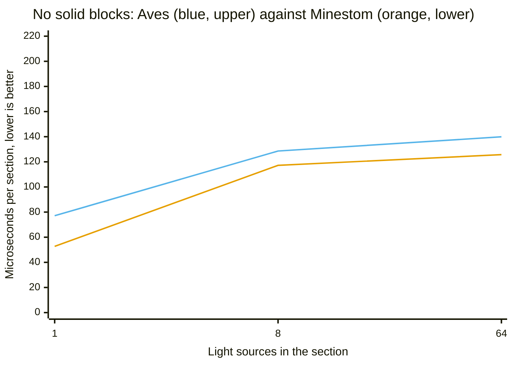
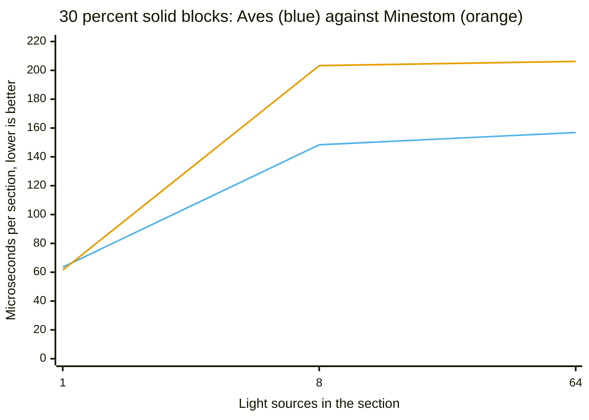
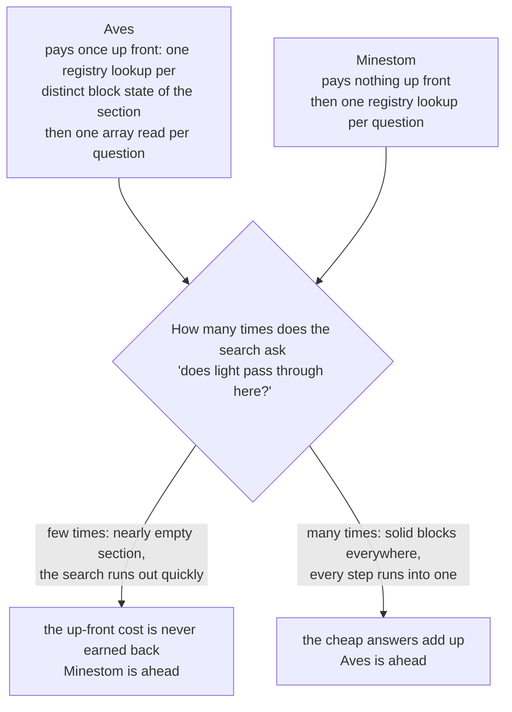
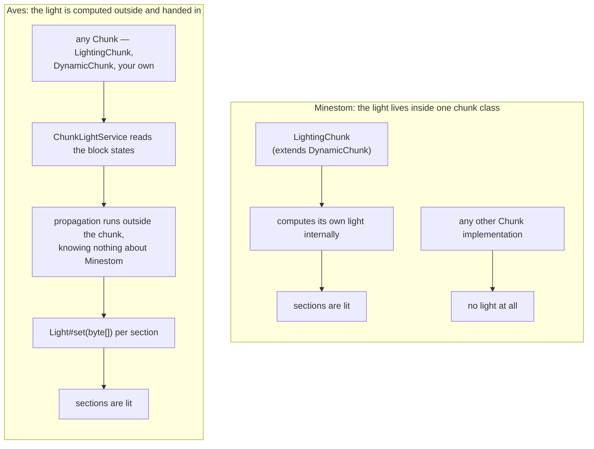
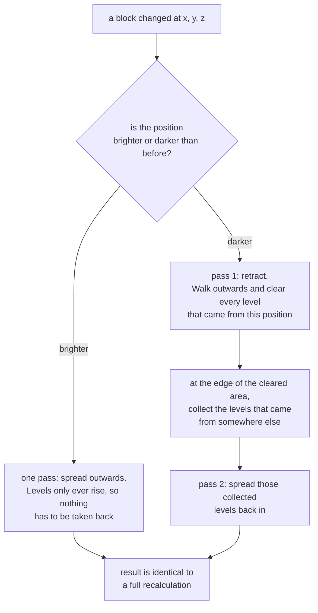

# Light engine

A light propagation for a single section that resolves the properties of a block once instead of on
every visit, and stores a uniform section without an array. The algorithm itself knows nothing about
Minestom, which is what makes it testable without a running server.

> **Experimental.** Every public type of `net.theevilreaper.aves.instance.light` is annotated
> `@ApiStatus.Experimental`. The API may still change.

> **Scope.** Block light and sky light for a chunk, across section borders, across chunk borders,
> and incrementally after a single block changed. Works with any chunk of any loader.
> See [Limits](#limits) for what is still missing.

## When this is worth using

Honest answer first, because it decides whether the package is relevant at all:

| Workload | Does light computation run? |
| --- | --- |
| Loading pre-lit worlds from `.mca` | **No.** The stored light is applied with `Light#set`, which clears `requiresUpdate()`. Nothing is recomputed — unless you call this engine explicitly. |
| Generated worlds without stored light | Yes |
| Runtime block placement | Yes |

For loading pre-built maps from region files — the dominant Aves use case — a light engine
contributes nothing, because that code path never executes. The measured cost of loading such a
chunk is dominated by NBT parsing and zlib inflation instead.

## Design

Seven types, each with one responsibility. Only the two on the right know Minestom exists.

```
                      ┌─ engine, no Minestom ─────────────┐   ┌─ adapter ──────────────┐
                      │                                   │   │                        │
  Chunk ──────────────┼──► int[] stateIds                 │   │  ChunkLightService     │
                      │         │                         │   │        │               │
                      │         ▼                         │   │        │ uses          │
                      │   SectionOpacity ◄── BlockLightSource ◄── MinestomBlockLight-  │
                      │         │            (one lookup   │   │        Source          │
                      │         ▼             per state)   │   │                        │
                      │   ChunkLightPropagator             │   │  writes back through   │
                      │         │  (crosses section        │   │  Light#set(byte[])     │
                      │         ▼   borders)               │   │                        │
                      │   List<LightNibbles> ──────────────┼───┼──►  Chunk sections     │
                      └───────────────────────────────────┘   └────────────────────────┘
```

| Type | Responsibility |
| --- | --- |
| `LightNibbles` | Storage. Two levels per byte, uniform sections without an array. |
| `BlockLightSource` | Abstraction over "how bright is this block and which faces does it block". |
| `SectionOpacity` | Precomputed table of those properties for one section. |
| `LightPropagator` | The breadth-first propagation, with reusable buffers. |
| `ChunkLightPropagator` | The same search across all sections of a chunk, so light crosses their borders. |
| `MinestomBlockLightSource` | Answers `BlockLightSource` from the block registry. |
| `ChunkLightState` | Keeps a calculated result and updates it incrementally, including the retraction pass and the sky heightmap. |
| `ChunkLightService` | Reads a chunk, runs the propagation, settles the borders against the neighbours, writes the result back. |

`BlockLightSource` exists for the same reason `PaletteEntryResolver` does in the Anvil package: it
keeps the registry out of the algorithm, so the propagation is verified with a handful of fake
blocks and no server at all.

## Where the resources are saved

### Time

The dominant cost of a naive propagation is not the search but the block lookups. A breadth-first
search reaches a block from up to six directions, and resolving palette → block → registry →
occlusion shape on each of those visits repeats the same work.

`SectionOpacity` resolves every **distinct state id** of a section exactly once when the table is
built and answers from two flat `byte[]` afterwards — an array index instead of a registry walk.
A section of 4096 stone blocks costs one lookup, which
`SectionOpacityTest#testEveryDistinctStateIsResolvedOnlyOnce` pins down.

Two further short cuts:

- A section without any emitting block returns immediately with a uniform dark result. No buffer is
  touched, no queue is built.
- Because a level drops by exactly one per block and the search is breadth-first, every position is
  reached with its final level on the first visit. No position is ever revisited or re-queued.

### Memory

- **Uniform sections carry no array.** `LightNibbles` keeps a single level and allocates the
  2048-byte array only when a level actually differs. Most sections of a world are either fully dark
  or fully lit, so this is the common case rather than an edge case. `fill` releases the array again.
- **A fully dark section reports an empty array** (`toArray().length == 0`), which is how the file
  format stores "no light" — nothing is written for it.
- **The propagator reuses its buffers.** The level buffer and the queue are allocated once per
  instance and cleared per run, so repeated propagation allocates nothing beyond the result. An
  instance is therefore reusable but thread confined — use one per worker rather than sharing one.
- **The queue is an `int[]`, not a collection.** No boxing, no growth: a section has 4096 positions
  and each is queued at most once, so the array is sized exactly once.

## Correctness details worth knowing

**Occlusion is per face, not per block.** Roughly one in seven block types of the game occludes some
faces and not others — slabs, stairs, snow, farmland, dirt paths, lecterns, stonecutters. A design
storing one flag per block answers those wrongly. `SectionOpacity` stores a six-bit mask per block;
`MinestomBlockLightSourceTest` pins the behaviour down on real bottom and top slabs.

**Only the entered face is tested.** Light passing from A to B is blocked by the face of **B** it
enters, not by the face of A it leaves. Testing both would leave every emitting block that is opaque
itself dark — and glowstone is exactly that. This is checked end to end against the real registry.

**Unknown block states are transparent, not fatal.** `Block.fromStateId` indexes an array without a
bounds check and throws for an id outside the known range. The adapter turns that into an absent
block, because a propagation must not lose a whole section over one unknown state.

**The face mapping is pinned by a test.** The adapter maps its faces onto the server's by ordinal.
`testTheFaceOrderMatchesTheOneOfTheServer` fails if Minestom ever reorders its enum, which would
otherwise silently shift every occlusion answer to the wrong face.

## Compared with the light engine Minestom ships with

`LightEngineComparisonBenchmark` runs both engines over the same section, from a block palette to a
finished light array of 2048 bytes. It lives in `net.minestom.server.instance.light` because the two
methods that make up the built-in path — `BlockLight.buildInternalQueue` and `LightCompute.compute` —
are package-private, which is the only way to measure the original instead of a copy of it. Neither
side gets to skip its preparation: the built-in path builds its seed queue, and the Aves path builds
its opacity table through the real block registry rather than a stand-in.

**The two engines produce the same light.** Across 54 scenarios the results are byte-identical: zero
differing cells, maximum level difference 0. Nothing in this section is a statement about
correctness — correctness is equal, not better. Everything below is about time.

```
java -jar build/libs/aves-*-jmh.jar "LightEngineComparisonBenchmark.(aves|minestom)" -f 1 -wi 3 -i 5
```

Measured on a machine that was **not idle**, one section per operation, `score ± error`, lower is
better.

| Light sources | Solid blocks | Aves | Minestom |
| ---: | ---: | ---: | ---: |
| 1 | 0 % | 77.1 ± 9.4 µs/op | 52.7 ± 1.7 µs/op |
| 8 | 0 % | 128.6 ± 19.1 µs/op | 117.2 ± 2.7 µs/op |
| 64 | 0 % | 139.9 ± 19.0 µs/op | 125.7 ± 9.1 µs/op |
| 1 | 30 % | 63.5 ± 5.5 µs/op | 61.5 ± 1.5 µs/op |
| 8 | 30 % | 148.4 ± 10.2 µs/op | 203.3 ± 14.7 µs/op |
| 64 | 30 % | 156.9 ± 11.1 µs/op | 206.2 ± 15.4 µs/op |

### A section without solid blocks: Minestom is ahead

In a section where nothing blocks the light, Aves is the slower of the two at every measured point.



`xychart-beta` draws no legend, so: the first line, the upper one, is **Aves** (blue); the lower one
is **Minestom** (orange). The scale runs to 220 although nothing here comes close to it, so that this
chart and the next one can be held against each other.

**Why.** Before Aves computes anything, it goes through the section once and notes down for every
block whether light passes through it. Writing that note costs time before a single ray has moved. In
a section with nothing in it, the search finishes almost immediately and hardly ever consults the
note — so the preparation was paid for and barely used. Minestom, which asks the block registry only
at the moment it actually needs an answer, is finished sooner.

**How firm that is.** Only the leftmost point, with one light source, has spreads that do not overlap
(77.1 ± 9.4 against 52.7 ± 1.7). At 8 and at 64 sources the error bars do overlap, so the gap the
chart draws there is not established by this measurement. What is established is the direction: Aves
is behind at all three points and ahead at none of them.

### A section with solid blocks: Aves is ahead from eight light sources on

Once 30 % of the blocks are solid, the picture turns around — but not yet at the single-source point.



Same order and the same colours as before: the first line is **Aves** (blue), the second **Minestom**
(orange). With one light source the two start out together; from eight onwards the Minestom line sits
clearly above.

**Why.** Now the note earns its keep. Solid blocks are exactly what a spreading light keeps running
into, and every time it does, the same question comes up again: does light get through here? Aves
reads the answer off the note it wrote at the start — one position in an array. Minestom asks the
registry again each time. The more often the question is asked, the more the one-off cost of writing
the note is worth; and how often it is asked is set by how many light sources are spreading and how
much they run into.

That is the whole shape of the result, and it is why there is a turning point rather than a winner:



**How firm that is.** At 8 and at 64 sources the spreads do not overlap — 148.4 ± 10.2 against
203.3 ± 14.7, and 156.9 ± 11.1 against 206.2 ± 15.4. At one source, 63.5 ± 5.5 against 61.5 ± 1.5,
the two are indistinguishable; the lines touching at the left edge of the chart is the honest picture
of that point, not a drawing artefact.

### Minestom is the steadier of the two

Beside the question of who is faster there is the question of how repeatable each answer is, and
there Minestom wins across the board. Its spreads in the table above run from ± 1.5 to ± 15.4; those
of Aves run from ± 5.5 to ± 19.1, and at both 0 % points with more than one source the Aves error is
larger than the entire difference being discussed. On the same not-idle machine, in the same run, the
built-in engine gives the more repeatable number. A single measurement of this engine is therefore
worth less than a single measurement of that one.

### On concurrency there is nothing to win here

The Anvil comparison in [`anvil-chunk-loader.md`](anvil-chunk-loader.md) turns on a lock that is held
across expensive work. It would be convenient to claim the same thing on the light side, and it is
not true. Minestom's light path is already built for several threads: `LightCompute` is purely static
and allocates its buffer per call, `BlockLight` keeps its buffers per section, and `LightingChunk`
already uses an `Executors.newWorkStealingPool()`. Nothing in there serialises work that could be
running in parallel, so there is no contention to remove.

### How the light reaches the chunk

This is the one argument for this engine that does not depend on a measurement, and it is the
strongest one. Minestom computes light **only** inside `LightingChunk` (`LightingChunk extends
DynamicChunk`). Use any other chunk implementation and no light is computed at all. Aves computes
outside the chunk and hands the finished array over through `Light#set`, which every chunk accepts.



The same property has a second consequence: because the propagation references no Minestom class at
all, it can be tested against a handful of fake blocks without a running server. Only the adapter
that answers from the real registry needs one.

### When to use Minestom's engine instead

Plainly, because the numbers above say it: if you already use `LightingChunk` and your sections are
mostly empty, the built-in engine is the better choice. It is faster on that shape of data, its
timings are steadier, it is already wired into the server and it costs no extra code. This engine is
worth reaching for where the built-in one cannot be used at all — any chunk that is not a
`LightingChunk`, which includes the chunk type an `InstanceContainer` uses unless it is told
otherwise — or where sections carry a real share of solid blocks together with more than one light
source.

## Usage

```java
import net.theevilreaper.aves.instance.light.LightNibbles;
import net.theevilreaper.aves.instance.light.LightPropagator;
import net.theevilreaper.aves.instance.light.MinestomBlockLightSource;
import net.theevilreaper.aves.instance.light.SectionOpacity;

// One per worker thread; it keeps reusable buffers.
LightPropagator propagator = new LightPropagator();
MinestomBlockLightSource source = new MinestomBlockLightSource();

int[] stateIds = new int[LightNibbles.BLOCK_COUNT];  // block states of one section
// ... fill stateIds from a palette ...

LightNibbles light = propagator.propagate(SectionOpacity.of(stateIds, source));

int level = light.get(8, 8, 8);
byte[] stored = light.toArray();                     // empty when the section is dark
```

`BlockLightSource` can be implemented directly to run the engine without a server:

```java
BlockLightSource fake = new BlockLightSource() {
    @Override public int emission(int stateId) { return stateId == LAMP ? 15 : 0; }
    @Override public boolean blocksFace(int stateId, BlockFace face) { return stateId == STONE; }
};
```

## Using it with a chunk loader or an instance

`ChunkLightService` is the entry point. It reads the block states of a chunk, propagates, and hands
the result to the sections through `Light#set(byte[])`:

```java
import net.theevilreaper.aves.instance.light.ChunkLightService;

ChunkLightService lighting = new ChunkLightService();   // one per worker thread

Chunk chunk = instance.loadChunk(0, 0).join();
lighting.calculate(chunk);

int level = lighting.blockLightAt(chunk, 8, 40, 8);
```

This works with **any** chunk, regardless of which loader produced it — the Anvil loader of Aves,
the one Minestom ships with, or a generated chunk. A test covers the round trip through
`AvesAnvilLoader` explicitly.

Two properties make this the stable way in:

- `Light#set(byte[])` is not marked internal, unlike `calculateInternal` / `calculateExternal`. The
  service therefore does not implement the `Light` interface and cannot break when the signatures of
  those internal methods change.
- `set` clears the update flag of the section, so the server does not recompute what was just
  written.

Locking follows the same three-stage split the Anvil loader uses: block states are read under the
read lock, the propagation runs with **no** lock held, and only the transfer of the result takes the
write lock.

### Sky light

```java
lighting.calculateSky(chunk);
```

Sky light enters from above and falls straight down **without losing a level** until something stops
it — which is why an open field is fully lit at every height while a cave is dark. Only after the
fall is interrupted does it spread like any other light, losing one level per block.

### Across chunk borders

```java
lighting.calculateWithNeighbours(instance, chunkX, chunkZ);
```

Lighting a chunk on its own ends its light at the border, which shows up as a straight dark line
every sixteen blocks. This method exchanges the border levels with every already loaded neighbour in
both directions. Neighbours that are not loaded are skipped rather than forced to load.

One round of that exchange is not enough. A source in the corner of a chunk sends light through two
borders, and the light that entered a neighbour has to leave it again on another side to arrive in
the chunk diagonally behind it. The exchange therefore repeats over the whole area — the chunk and
the eight positions around it — until no chunk of it raises a level any more:

| Property | How it is reached |
| --- | --- |
| Terminates | An injection only ever raises a level, and a level is capped at fifteen, so the repetition walks towards a fixed point. |
| Same result every time | The area is a fixed-size array walked in a fixed order, not a map. Since every step only raises levels, the fixed point does not depend on the order either. |
| Reads a chunk once | The opacity tables of every participating chunk are built once, before the first round, and reused by all of them. |
| Cannot loop forever | The amount of rounds is capped at sixteen, which is one more than the highest level that can exist. Hitting the cap is reported through `LOGGER.warn` instead of being accepted silently. |

A radius of one chunk is enough because a level of fifteen cannot survive sixteen blocks of travel,
so nothing the middle chunk emits can reach a second ring.

### Incremental updates

`ChunkLightService#calculate` always recomputes the whole chunk. For a single block change that is
wasteful, and `ChunkLightState` exists for that case:

```java
ChunkLightState state = ChunkLightState.blockLight(opacityTables);

// after a block changed at that position
state.update(updatedOpacityTables, x, y, z);
List<LightNibbles> light = state.toSections();
```

Adding brightness is straightforward — it only spreads. **Removing** it is the hard case and the
reason this class exists: when a light source disappears, the brightness it had spread is still
stored in every block around it, and spreading again would keep that glow forever. The update
therefore runs two passes. The first retracts every level that originated from the changed position
and collects the still valid levels it meets at the edge of the retracted area; the second spreads
those back in.

Which way an update goes, drawn out:



The second pass is not a correction of the first. The light of every *other* source in the
neighbourhood is legitimate and was cleared along with the rest simply because it stood in the way;
collecting it at the edge and letting it back in is what puts it back. Skipping the retraction
instead and only spreading again would leave the removed source's glow in place for good.

`ChunkLightStateTest#testTheIncrementalResultMatchesAFullRecalculation` asserts that the incremental
result is identical to a full recalculation, block for block.

#### Sky light updates

Sky light has an origin no block holds: it falls in from above. An update can therefore not tell
from the levels alone which positions lost their origin and which gained one, and a state that holds
sky light keeps a heightmap for that reason — the highest position that stops the sky, per column.

A block change moves exactly one column of that heightmap, and the difference between the old and
the new height names the positions whose origin changed:

| Change | Effect on the column |
| --- | --- |
| A block is placed above the current height | Everything between the old and the new height falls out of the open sky and gives its level back. What is left is refilled from the sides, which is why a single pillar leaves a level of fourteen below it rather than darkness. |
| The highest blocking block is removed | The column opens down to the next block below, and every position in between receives the full level again and spreads it. |
| The change is below the height | The height stays where it is. The changed position is retracted and refilled from its neighbours, exactly as a block light update works. |

Only the changed column is walked again, so an update no longer re-seeds all two hundred and fifty
six columns of the chunk.

`SkyLightUpdateTest` asserts the result against a full recalculation block for block, for both
directions, for a change that is not in the highest blocking position, and for a seeded sequence of
random changes that verifies the equality after every single one of them.

### When to call what

| Situation | Method |
| --- | --- |
| Chunk loaded without stored light, or generated | `calculate` / `calculateSky` |
| Chunk loaded and neighbours matter | `calculateWithNeighbours` |
| A single block changed | `ChunkLightState#update` |

## Limits

- **No `Light` implementation.** The engine deliberately does not implement
  `net.minestom.server.instance.light.Light`. It writes its result through `set` instead, which
  avoids depending on the internal calculation methods of that interface.
- **The exchange covers one ring of chunks.** `calculateWithNeighbours` settles the chunk and the
  eight positions around it. That is enough for the light of the middle chunk, but the outer chunks
  of the area are not settled against their own neighbours outside of it.
- **`Section.clone()` discards foreign light.** Should an adapter be built later, note that
  `Section.clone()` calls `Light.sky()` / `Light.block()` outright, so any custom implementation is
  silently replaced on copy. `LightingChunk.copy()` would have to be overridden.

## Tests

Everything except `MinestomBlockLightSourceTest` runs without a Minestom server. The adapter test
uses Cyano's `MicrotusExtension` because it needs the real block registry — which is the point: the
directional occlusion of a slab is only meaningful against real block data.
